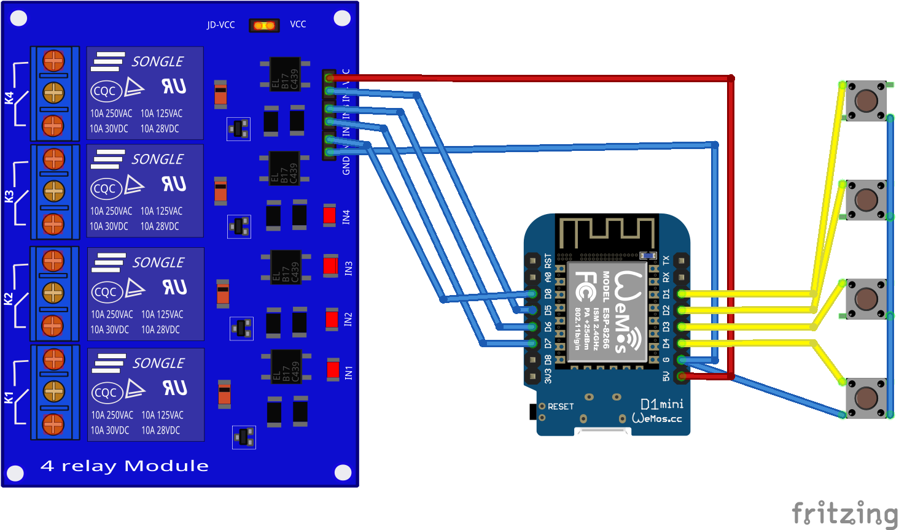

# esp_schaltbare_Steckdose
esp8266-basierte schaltbare WLAN-Steckdosensteuerung mit Timerfunktion

Der Schaltplan bezieht sich noch auf die Hardwareversion "min".

## Umgebung
### Software
Arduino 2.1.1 mit zusätzlicher Boardverwalter-URL http://arduino.esp8266.com/stable/package_esp8266com_index.json .

Die externen Libraries 

* [time](https://github.com/PaulStoffregen/Time)
* mit IIC (I2C)
  * [Adafruit_MCP23017](https://github.com/adafruit/Adafruit-MCP23017-Arduino-Library)
* mit Echtzeituhr
  * [RTClib](https://github.com/adafruit/RTClib)
* mit OLED-Display zusätzlich
  * [Adafruit GFX Library](https://github.com/adafruit/Adafruit-GFX-Library)
  * [Adafruit SSD1306](https://github.com/adafruit/Adafruit_SSD1306)
  
von /libs nach arduino/libraries kopieren. Andere Anhängigkeiten bestehen nicht.

### Hardware
nodemcu 0.9 bzw wemos mini D1, 4-fach Relaisplatine und 4-fach Taster.

## Funktion
### Start als AP
Wenn kein WLan-Netz angegeben ist wird der esp8266 als Accesspoint gestartet mit SSID WebSchalter, ohne Passwort. Zur ersten Konfiguration verbindet man sich mit diesem Netz und startet im Webbrowser http://192.168.168.30 . Erzwingen lässt sich dieser Zugang wenn beim Einschalten Teste 1 und 2 gleichzeitig gedrückt werden.

### Start als Station
Mit konfiguriertem WLan wählt sich der esp8266 in das vorhandene Netzwerk ein und kann über Webbrowser konfiguriert werden.

### Schalten ###
Die 4 Relais können unabhängig voneinander über bis zu 50 Timereinstellungen geschaltet werden. Dazu liest der esp8266 die aktuelle Zeit (MEZ mit deutscher Sommer-/Winterzeitumstellung) vom Internet. In der Hardwareversion "iic" ist zusätzlich eine Echtzeituhr als Puffer eingebaut. Zusätzlich kann jedes Relais mit Taster umgeschaltet werden.

### Timerfunktion
Einstellungen sind sekundengenau täglich, für einzelne Wochentage, Wochenende, Arbeitstage (Mo-Fr) und Feiertage möglich. Die Feiertagsberechnung ist für Deutschland/Hamburg zur Zeit fest programmiert, für andere Bundesländer aber vorbereitet. 

Der Timer läuft auch in der Hardwareversion "min" ohne WLan-Verbindung weiter, benötigt dann aber für eine korrekte Uhrzeit eine regelmäßige Internetverbindung. Besonders nach Stromausfall ist bei dieser Hardwareversion eine Internetverbindung zwingend.

### Sicherheit
Der esp8266 lässt nur unverschlüsselte Verbindungen zu. Lesezugriff (Benutzer user) und Schreibzugriff (Benutzer admin) können aber über Passworte gesichert werden.
